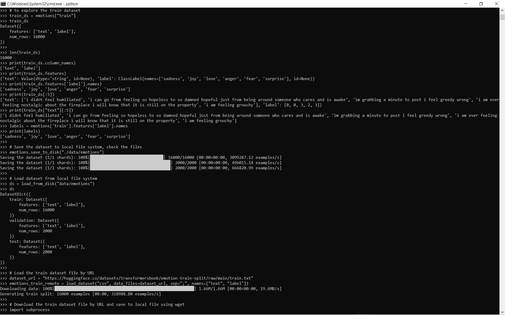
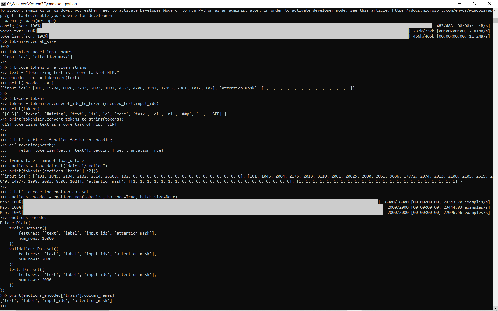
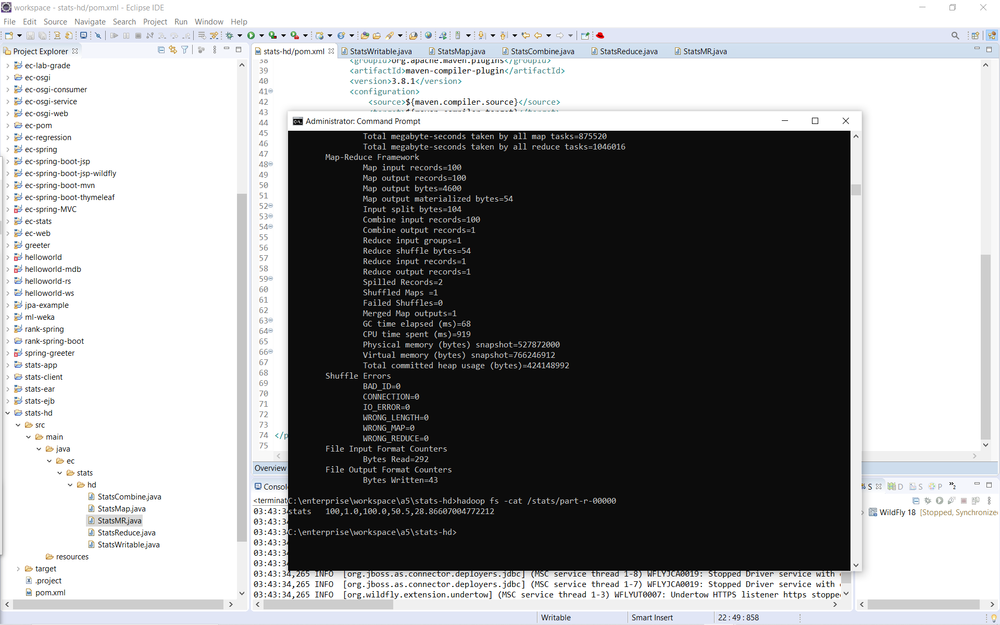
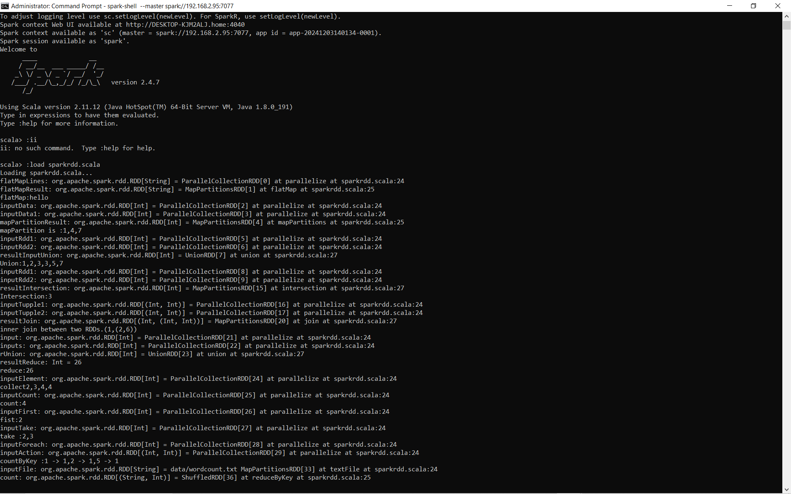
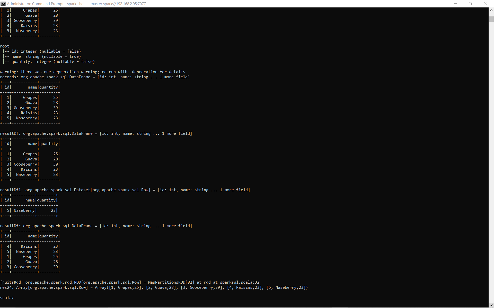
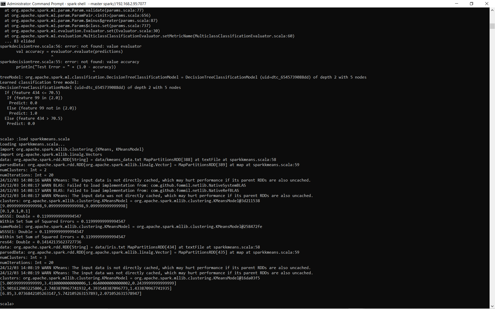
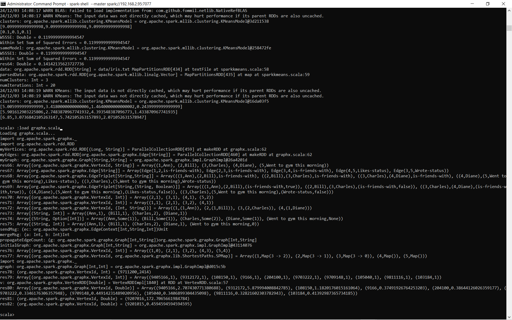
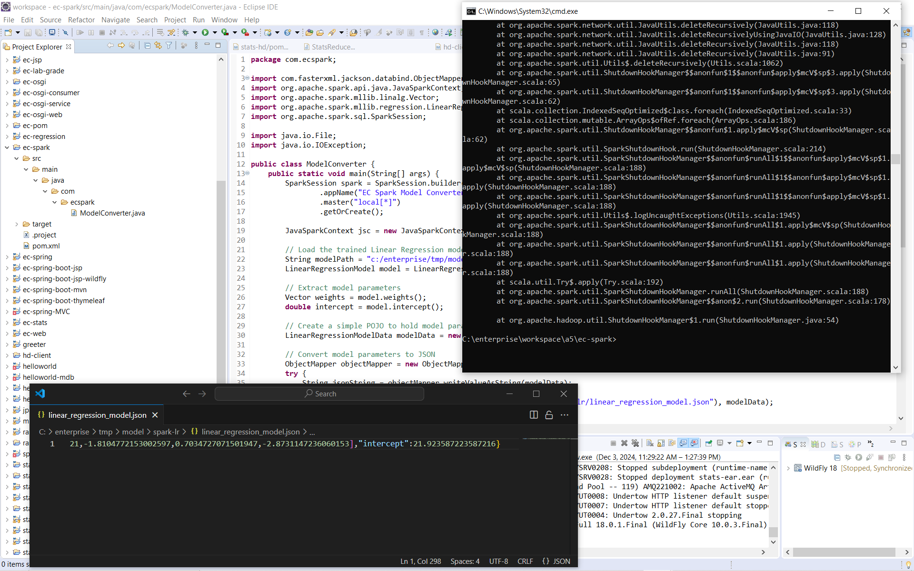

## 📘 Overview

The Data Fusion Analytics Platform is an end-to-end system that demonstrates how large-scale data processing, distributed computing, machine learning, and modern NLP transformers can work together inside a unified analytics workflow. It spans Hadoop MapReduce, Spark, classical ML regression models, and transformer-based text analysis, while exposing prediction and statistical insights through enterprise-friendly microservices.

The platform begins with distributed statistics computing using the Hadoop ecosystem. A MapReduce workflow computes descriptive statistics such as min, max, mean, count, and standard deviation on a large numerical dataset stored in HDFS. This simulates real big-data processing pipelines where raw files are too large for single-machine analysis.

Next, the system explores data analytics through Apache Spark, using both RDD-based transformations and Spark SQL queries. This includes cleaning, filtering, aggregations, and ML model training using Spark’s machine learning library. Spark enables fast, scalable data exploration that reflects real enterprise data engineering practices.

Machine learning is integrated into the platform through a Java-based model workflow. A linear regression model is trained on structured data, exported in both binary and JSON formats, and prepared for EC (enterprise computing) integration. This model can then be consumed by Java services, Python microservices, or other components for prediction tasks. The workflow mirrors how organizations move trained models into production environments.

The project also incorporates transformer-based NLP models using the Hugging Face ecosystem. It includes dataset exploration, tokenization, fine-tuning, and downstream inference. A transformer model is customized to perform emotion classification and then wrapped inside a Python Flask microservice for real-time prediction. Clients can send text to the service and receive a predicted class with a confidence score, demonstrating modern AI deployment patterns.

Together, these components form a comprehensive multi-technology analytics platform. It showcases how big-data tools, machine learning models, and AI microservices can cooperate within a unified solution that handles large-scale computation, predictive modeling, and intelligent text analysis. The system reflects the architecture used across modern enterprises that combine legacy big-data pipelines, scalable analytics engines, and state-of-the-art transformer models to support advanced decision making.

---

## 🧱 Project Structure

```
C:.
├── ec-finetuned-emotions/        # Python Flask microservice for emotion prediction
│   └── app.py
│
├── ec-spark/                     # Spark → JSON model conversion for EC integration
│   ├── pom.xml
│   ├── src/main/java/com/ecspark/ModelConverter.java
│   └── target/…                  # Built JARs and compiled classes
│
├── ec-transformer-finetune/      # Transformer fine-tuning and dataset handling
│   ├── hf_datasets.py            # Load and explore the emotions dataset
│   ├── hf_downstream.py          # Fine-tune, evaluate and save the model
│   ├── hf_tokenizer.py           # Tokenization and encoding pipeline
│   ├── data/emotions/…           # Saved Hugging Face dataset (train/val/test)
│   └── ec-finetuned-emotion/…    # Checkpoint of the fine-tuned transformer model
│
├── hd-client/                    # Java client that consumes Hadoop stats
│   ├── pom.xml
│   ├── src/main/java/ec/hd/StatsHDFSClient.java
│   ├── src/main/java/ec/stats/StatsSummary.java
│   └── src/main/resources/log4j.properties
│
├── images/                       # Screenshots used in the README
│   └── *.PNG
│
└── stats-hd/                     # Hadoop MapReduce job for summary statistics
    ├── pom.xml
    ├── statsdata.txt             # Numeric input data for MapReduce
    └── src/main/java/ec/stats/hd/
        ├── StatsMap.java         # Mapper
        ├── StatsReduce.java      # Reducer
        ├── StatsCombine.java     # Combiner
        ├── StatsWritable.java    # Custom Writable for stats
        └── StatsMR.java          # Job driver

```
---
🛠 Technologies Used

  - Hadoop MapReduce - batch computation of basic statistics on large numeric data
  
  - HDFS - storage layer for statsdata and MapReduce outputs
  
  - Apache Spark 2.4

    - RDD operations
    
    - Spark SQL DataFrames
    
    - MLlib (classification, clustering, regression)
    
    - GraphX for graph analytics

  - Hugging Face Datasets - loading and managing the dair-ai/emotion dataset

  - Hugging Face Transformers + PyTorch - fine-tuning a text classification model for emotion detection

  - Python + Flask - REST microservice on top of the fine-tuned model

  - Java, Maven - for MapReduce jobs, Spark model conversion, and the Hadoop stats client
  ---

🔗 How the Pieces Fit Together

  - Hadoop path – numeric statistics

    - stats-hd runs a MapReduce job over statsdata.txt in HDFS, computing count, min, max, sum and derived measures.
    
    - hd-client then connects to HDFS, reads the results, and prints a StatsSummary to the user.

  - Spark path – data analytics and ML models

    - Spark shell examples demonstrate RDD transformations, SQL queries, MLlib models (decision tree and k-means) and GraphX analytics.
    
    - In ec-spark, ModelConverter.java loads a trained Spark linear regression model and exports its weights and intercept to linear_regression_model.json so other systems can consume it.

  - Transformer path – emotion classification

    - ec-transformer-finetune loads the dair-ai/emotion dataset, tokenizes the text, fine-tunes a transformer for emotion classification, and saves the dataset plus the fine-tuned model checkpoint under ec-finetuned-emotion/checkpoint-500.
    
    - ec-finetuned-emotions/app.py exposes this model as a Flask API. Clients send raw text and receive the predicted emotion label with confidence.
    
    - Together, the project shows a full spectrum: batch statistics in Hadoop, interactive analytics and ML in Spark, and modern NLP with transformers deployed as a microservice.


---

📊 Results and Screenshot Explanations


1. Exploring the Emotions Dataset

    
    
    This screenshot shows the emotions dataset from Hugging Face being loaded and explored in Python:
    
      - The dataset is split into train, validation and test with 16,000, 2,000 and 2,000 examples.
      
      - Example texts and labels are printed, and the label names are displayed as
      ['sadness', 'joy', 'love', 'anger', 'fear', 'surprise'].
      
      - The dataset is saved locally under ec-transformer-finetune/data/emotions.
    
    This confirms that the raw text data is correctly loaded, labeled and persisted, which is the foundation for fine-tuning the transformer model.

2. Tokenization and Encoding Pipeline

    
    
    Here the tokenizer and encoding pipeline are tested:
    
      - A single sentence is tokenized, showing input_ids and attention_mask.
      
      - Tokens are converted back to strings to verify that special tokens like [CLS] and [SEP] wrap the text correctly.
      
      - The emotions dataset is mapped through the tokenizer to create input_ids and attention_mask for all splits, producing the emotions_encoded dataset.
      
    This demonstrates that free-text inputs are transformed into the numerical tensors expected by the transformer model, and that the full dataset has been encoded successfully.

3. Fine-tuning and Single-text Prediction

    Image: images/Explore-fine-tuning.PNG
   
    
    This screenshot captures the end of the fine-tuning process:
    
      - The Hugging Face Trainer runs for multiple epochs, reporting training and evaluation metrics.
      
      - Final evaluation shows roughly test_accuracy ≈ 0.9275 and test_f1 ≈ 0.9272, indicating strong performance on the validation set.
      
      - The fine-tuned model is saved to c:/enterprise/tmp/model/ec-finetuned-emotion.
      
      - A sample text such as "i didnt feel humiliated" is passed through the model and the output is
      {'class': 'sadness', 'confidence': 0.97…}.
      
    This proves that the model not only trains successfully but also produces sensible emotion predictions for real sentences.

4. Transformer Microservice for Emotion Prediction

    
    
    In this screenshot:
    
      - The Flask app in ec-finetuned-emotions/app.py is started, loading the fine-tuned model from ec-finetuned-emotion.
      
      - The console shows the app running on http://127.0.0.1:8000.
      
      - A curl POST request is sent to /predict with JSON like {"type": "emotion", "text": "I like EC"}.
      
      - The service responds with a predicted emotion, for example {"class": "fear", "confidence": 0.84…}.
      
    This demonstrates that the transformer model is now a live HTTP API, turning raw text into emotion labels in real time.

5. Hadoop MapReduce Statistics Model

    
    
    This image shows a Hadoop MapReduce job from the stats-hd module running on the cluster:
    
      - Map and reduce task counters are displayed (map input records, output records, shuffle statistics, etc.).
      
      - The job processes the numeric values in statsdata.txt and writes the final statistics to stats/part-r-00000.
      
      - A follow-up command hadoop fs -cat /stats/part-r-00000 prints a line such as
      stats 100,1,1.0,100.0,5.5,28.8667004772212, representing count, min, max, sum, mean and standard deviation.
    
    This validates that the MapReduce code correctly computes global statistics on data stored in HDFS.

6. Spark RDD Operations

    
    
    This screenshot shows interactive RDD operations inside spark-shell:
    
      - Multiple transformations are demonstrated: parallelize, flatMap, map, union, join, intersection, reduceByKey, keyBy and more.
      
      - A word-count like example over wordcount.txt is executed.
      
      - The output RDDs show how data flows through the pipeline at each step.
    
    These examples confirm that Spark RDDs are functioning as expected and illustrate the low-level building blocks used before moving to higher-level APIs.

7. Spark SQL and DataFrame Queries


    
    
    Here Spark SQL and DataFrames are used:
    
      - A small fruits dataset with schema [id, name, quantity] is loaded into a DataFrame.
      
      - Several operations are run: show(), filters, and selections by condition.
      
      - The result DataFrames and their schema are printed.
    
    This demonstrates how Spark SQL can represent structured data and answer queries with familiar relational-style operations.

8. Spark MLlib - Classification and Clustering

    
    
    This screenshot shows MLlib in action:
    
      - A decision tree classification model is trained and printed as a readable tree.
      
      - K-means clustering is run on numeric data; the final cluster centers are listed, along with the sum of squared errors.
    
    These experiments verify that Spark can train classical ML models at scale and that the resulting model parameters are accessible for inspection.

9. Spark GraphX Social Graph Example

    
    
    Here GraphX is used to build and analyze a small social network:
    
      - Vertices and edges represent people and relationships such as “is-friends-with” and “likes-status”.
      
      - A Graph object is created and algorithms like shortest paths or centrality are evaluated.
      
      - The results show numeric scores per vertex.
    
    This confirms that GraphX can model graph-structured data and compute network measures inside the same Spark environment.

10. Spark Model Conversion for EC Integration

    
    
    This screenshot ties Spark models back to the enterprise integration story:
    
      - ModelConverter.java in ec-spark loads a Spark linear regression model from disk.
      
      - It extracts the learned weights and intercept and writes them to linear_regression_model.json.
      
      - The JSON file is shown in a text editor with fields like "weights": [...] and "intercept": 21.92….
    
    This step converts a Spark-trained model into a neutral JSON format so that other platforms (for example the EC statistics platform or a different microservice) can reuse the model without relying on Spark runtime.

---
## 🏃‍♂️ How to Run This Project

comming soon !!!

---
